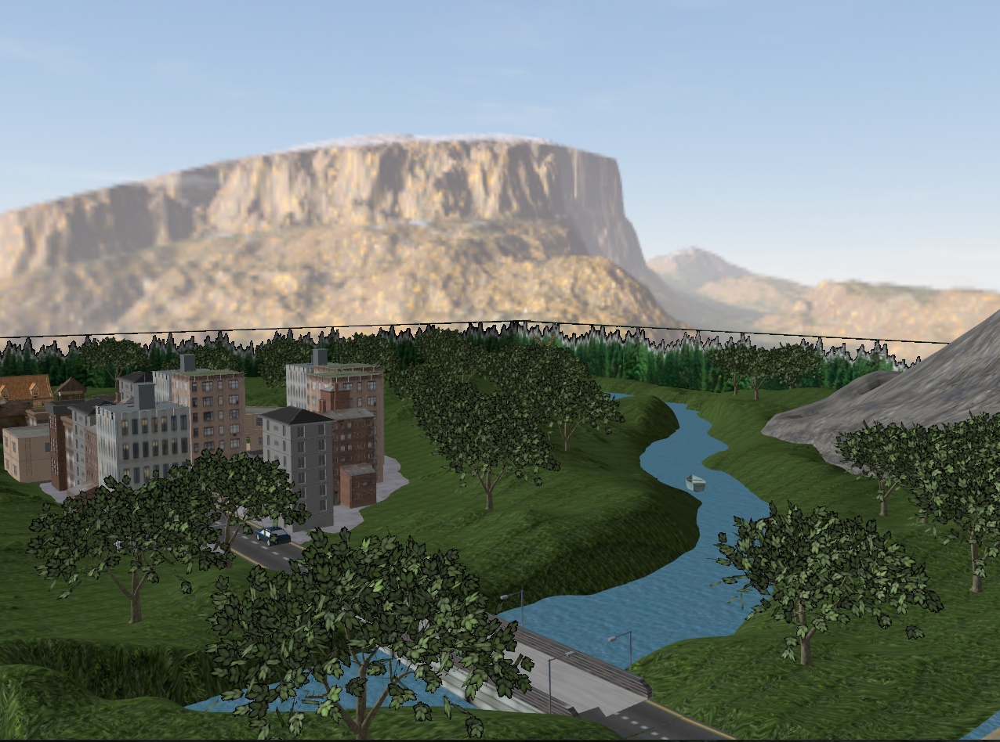
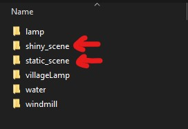

# OpenGL 3D Scene

A 3D interactive scene built using **OpenGL**, **GLFW**, and **GLM**, featuring camera navigation, lighting control, basic animations, and multiple rendering modes. 

The project showcases the full graphics pipeline: model loading, transformations, shading, and real-time user interaction.

## Important

- Due to file size limitations, part of the ".obj" files and textures have to be downloaded from an external source: https://mega.nz/file/Yd9jHYrK#je9dZQetPSL_El47wiFqE_5jOxLuQ8zhYyLFNtAmU_0
- After unzip, the folders should be placed inside the "models" directory as seen in the following image:

## Scene Overview
The scene represents a small stylized environment containing:
- Buildings, houses, a bridge, trees, and a surrounding skybox  
- Cars, a boat, statues, benches, and a windmill with rotating blades  
- A river flowing beneath a mountain slope  
- Point light sources (lamps) and a global directional light  

All models were imported as `.obj` files and textured with freely available assets.

## Features
- Free camera movement: mouse look + WASD + vertical movement  
- Automatic cinematic presentation on startup  
- Toggleable lighting: global light, point lights, and specular highlights  
- Rendering modes: solid, wireframe, polygon, smooth  
- Windmill animation and skybox rendering  
- Texture handling with transparency support  

## Controls
- Camera: mouse (rotation), W/A/S/D (horizontal), Z/X (vertical)  
- Toggle lights:  
  - `L` – global light  
  - `K` – point lights  
- Rendering modes: `1/2/3/4`  
- Show camera position: `P`  
- Capture/Release mouse: `TAB`
